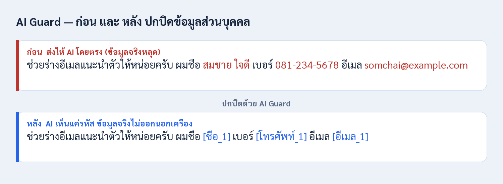

<p align="center">
  
</p>

<h1 align="center">AI Guard</h1>

<p align="center">
  Thai PII detection, anonymization, PDF redaction, and PDPA risk analysis<br />
  for local AI workflows and AI for Thai services.
</p>

<p align="center">
  <a href="https://github.com/Teerapat-Vatpitak/thai-pii-redaction/releases/latest"></a>
  <a href="https://github.com/Teerapat-Vatpitak/thai-pii-redaction/actions/workflows/ci.yml"></a>
  
  <a href="LICENSE"></a>
</p>

<p align="center">
  
</p>

AI Guard finds Thai personal data before it reaches a downstream AI. It combines
regex and checksum validation for structured identifiers with Thai NER and
context rules for names and addresses. It can replace detected values with
tokens such as `[ชื่อ_1]` or realistic surrogates, restore them when the caller
still owns the mapping, permanently redact PDFs, and produce a PDPA-oriented
risk report.

## What is included

| Capability | What it does |
|---|---|
| Thai PII detection | Detects structured PII, names, addresses, dates, and selected quasi-identifiers. |
| Mask and restore | Token or surrogate anonymization with an in-memory mapping and outbound leak checks. |
| PDF redaction | Paints PII at word bounding boxes and flattens the result so the original text layer is not recoverable. |
| PDPA analysis | Reports direct PII, Section 26 signals, and re-identification risk without including raw values in the generated report. |
| Protected AI roundtrip | Masks a prompt, calls a configured provider such as Pathumma, and restores the answer without exporting the transient mapping. |
| Prompt-injection signals | Flags known Thai and English instruction-override patterns as a transparent, rule-based first layer. It warns; it is not a complete defense. |

## Two deployment contexts

AI Guard has one core but two different trust boundaries. They must not be
described as if they were the same deployment.

| Context | Privacy boundary |
|---|---|
| Local desktop and browser extension | Detection, pseudonymization, and the mapping stay on the user's device. An external AI receives only the masked text. |
| Hosted platform service | The raw request reaches the platform-hosted AI Guard container. AI Guard does not persist the transient mapping or write user text to its logs; a protected Pathumma roundtrip sends only masked text to Pathumma. |

The hosted statement is intentionally narrower than the local statement. AI
Guard does not claim that raw PII stays on the user's device when the user calls
a hosted service.

## Storefronts

- Browser extension: in-page Mask/Restore for supported AI sites plus a docked
  side panel.
- Desktop app: bundled Tauri shell and local FastAPI sidecar.
- HTTP API: detection, sanitization, re-identification, analysis, reporting,
  guard, PDF, and demo endpoints.
- Queue worker: stateless operations behind a replaceable transport adapter for
  AI for Thai onboarding.
- CLI: scripted sanitize/report workflows and an end-to-end demo pipeline.

All storefronts call the same core under `pii_redactor/`; they do not maintain
separate detection implementations.

## Install the local product

Download the installer for your platform from the
[latest release](https://github.com/Teerapat-Vatpitak/thai-pii-redaction/releases/latest):

| Platform | File |
|---|---|
| Windows | `AI.Guard_<version>_x64-setup.exe` |
| macOS (Apple Silicon) | `AI.Guard_<version>_aarch64.dmg` |
| Linux | `.AppImage` or `.deb` |

The installer bundles the backend, so no Python setup is required. It is
unsigned by design. Verify the checksum and GitHub build provenance before
installing; see [SECURITY.md](SECURITY.md).

To add the in-page browser bar, load `extension/` unpacked at
`chrome://extensions` while the desktop app is running. See
[extension/README.md](extension/README.md).

## Run the API container

```bash
docker compose up --build ai-guard
```

The local Compose profile publishes only to `127.0.0.1:8000`. A hosted
deployment must set its API key and platform-specific transport/configuration;
do not treat the local Compose defaults as a production profile. See
[AI for Thai integration](docs/platform/ai-for-thai.md).

Running directly from source: [docs/install-from-source.md](docs/install-from-source.md).

## Verify a release

Every release asset is listed in `SHA256SUMS` and carries GitHub build
provenance:

```bash
sha256sum -c SHA256SUMS --ignore-missing
gh attestation verify <file> -R Teerapat-Vatpitak/thai-pii-redaction
```

This verifies origin and integrity. It is not a claim of bit-for-bit
reproducibility.

## Status

The implemented feature set is being driven through acceptance before the next
accuracy phase. The AI for Thai transport remains provisional until the
platform supplies the account and wire specification. No public accuracy claim
should be inferred from the current diagnostic corpus.

- [Current feature status](docs/project-status.md)
- [Roadmap](ROADMAP.md)
- [Architecture and trust boundaries](docs/architecture.md)
- [Release process](docs/release-process.md)

AI Guard is a safety layer, not a guarantee. Review high-risk material before
sending or publishing it. It is not affiliated with or endorsed by the AI
providers named in the integration examples.

## Documentation

- [Documentation map](docs/README.md)
- [Contributing](CONTRIBUTING.md)
- [Security policy](SECURITY.md)
- [Changelog](CHANGELOG.md)
- [Decision records](docs/decisions/README.md)

## License

Apache-2.0 - see [LICENSE](LICENSE) and [NOTICE](NOTICE).
