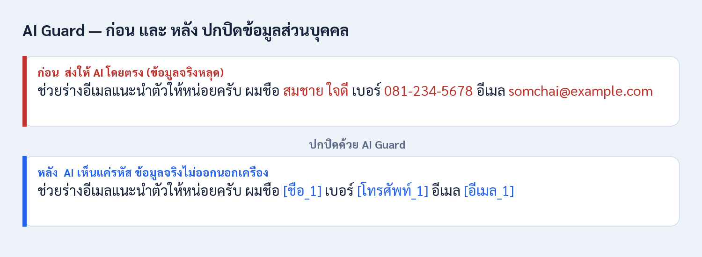

<p align="center">
  
</p>

<h1 align="center">AI Guard</h1>

<p align="center">
  Thai PII detection, anonymization, PDF redaction, and PDPA risk analysis<br />
  for local AI workflows and AI for Thai services.
</p>

<p align="center">
  <a href="https://github.com/Teerapat-Vatpitak/thai-pii-redaction/releases/latest"></a>
  <a href="https://github.com/Teerapat-Vatpitak/thai-pii-redaction/actions/workflows/ci.yml"></a>
  
  <a href="LICENSE"></a>
</p>

<p align="center">
  
</p>

AI Guard finds Thai personal data before it reaches a downstream AI. It combines
regex and checksum validation for structured identifiers with Thai NER and
context rules for names and addresses. It can replace detected values with
tokens such as `[ชื่อ_1]` or realistic surrogates, restore them when the caller
still owns the mapping, permanently redact PDFs, and produce a PDPA-oriented
risk report.

## What is included

| Capability | What it does |
|---|---|
| Thai PII detection | Detects structured PII, names, addresses, dates, and selected quasi-identifiers. |
| Mask and restore | Token or surrogate anonymization with an in-memory mapping and outbound leak checks. |
| PDF redaction | Paints PII at word bounding boxes and flattens the result so the original text layer is not recoverable. |
| PDPA analysis | Reports direct PII, Section 26 signals, and re-identification risk without including raw values in the generated report. |
| Protected AI roundtrip | Masks a prompt, calls a configured provider such as Pathumma, and restores the answer without exporting the transient mapping. |
| Prompt-injection signals | Flags known Thai and English attacks with explicit rules plus bounded normalization/intent features. It warns; it is not a complete defense. |

## Two deployment contexts

AI Guard has one core but two different trust boundaries. They must not be
described as if they were the same deployment.

| Context | Privacy boundary |
|---|---|
| Local desktop, browser extension, and Office Add-in | Detection, pseudonymization, and the mapping stay on the user's device. An external AI receives only the masked text. |
| Hosted platform service | The raw request reaches the platform-hosted AI Guard container. AI Guard does not persist the transient mapping or write user text to its logs; a protected Pathumma roundtrip sends only masked text to Pathumma. |

The hosted statement is intentionally narrower than the local statement. AI
Guard does not claim that raw PII stays on the user's device when the user calls
a hosted service.

## Storefronts

- Browser extension: in-page Mask/Restore for supported AI sites plus a docked
  side panel.
- Desktop app: bundled Tauri shell and local FastAPI sidecar.
- Microsoft 365 Add-in: one Thai task pane with Word, Excel, and PowerPoint
  adapters. Automated checks and a partial local XML real-host functional slice
  pass with synthetic PII. The current unified release manifest is Word-only;
  Excel and PowerPoint remain acceptance-only until their host gates and the
  packaged three-host ribbon/task-pane activation pass. Schema and acquisition
  metadata are not a Marketplace or broad Office-distribution claim.
- HTTP API: detection, sanitization, re-identification, analysis, reporting,
  guard, PDF, and demo endpoints.
- Hosted HTTP adapter: the official AI for Thai guide selects FastAPI behind a
  reverse proxy and Docker Compose; its narrow platform adapter is pending the
  remaining route/auth answers.
- Provisional job worker: stateless operations retained as a local
  failure/retry emulator, not the official platform delivery path.
- CLI: scripted sanitize/report workflows and an end-to-end demo pipeline.

All storefronts call the same core under `pii_redactor/`; they do not maintain
separate detection implementations.

## Repository structure

| Path | Responsibility |
|---|---|
| `pii_redactor/` | Shared detection, masking, vault, provider, restore, validation, report, and PDF logic. |
| `app/` | FastAPI and provisional worker adapters; no separate detection or vault implementation. |
| `ai_guard.py` / `demo_cli.py` | Supported CLI entry points for reports, sanitization, compliance tools, and the end-to-end demo. |
| `extension/` | Chrome MV3 storefront and site adapters. |
| `desktop/` | Tauri shell, static UI, and packaged-sidecar integration. |
| `office-addin/` | Word, Excel, and PowerPoint task pane and host adapters. |
| `demo/` | Opt-in browser playground. |
| `benchmark/` / `research/` / `training/` | Synthetic evaluation, privacy-reviewed evidence, and optional training material. |
| `scripts/` | Build, acceptance, performance, dependency-lock, version, and release helpers. |
| `tests/` | Core, adapter, privacy, benchmark, packaging, and release contract tests. |
| `docs/` | Current operating documents and historical decision records. |

Generated reports, runtime logs, local environments, model caches, and build
output are intentionally not part of the published source tree. The committed
benchmark locks, synthetic gold data, sanitized government-form inputs, and
privacy-reviewed evidence are reproducibility inputs and remain versioned.

## Install the local product

Download the installer for your platform from the
[latest release](https://github.com/Teerapat-Vatpitak/thai-pii-redaction/releases/latest):

| Platform | File |
|---|---|
| Windows | `AI.Guard_<version>_x64-setup.exe` |
| macOS (Apple Silicon) | `AI.Guard_<version>_aarch64.dmg` |
| Linux | `.AppImage` or `.deb` |

The installer bundles the backend, so no Python setup is required. It is
unsigned by design. Verify the checksum and GitHub build provenance before
installing; see [SECURITY.md](SECURITY.md).

To add the in-page browser bar, load `extension/` unpacked at
`chrome://extensions` while the desktop app is running. See
[extension/README.md](extension/README.md).

To develop or sideload the Windows Office task pane, see
[office-addin/README.md](office-addin/README.md). It reuses the running local
backend and does not ship in the current installer.

## Develop from source

Requirements are Python 3.11+ and Git. Node 22 is required for the Office
Add-in and JavaScript test harness; Rust is required only to build the desktop
shell. Windows is the primary local development platform.

The quickest local start is:

```powershell
$env:PYTHONUTF8='1'
./run.ps1
```

`run.ps1` creates `.venv` and installs the core plus web dependencies on first
run. The equivalent Git Bash/Linux/macOS command is `./run.sh`. The backend
serves `http://localhost:8000`; check `http://localhost:8000/api/health` before
starting a storefront.

For a manual setup, install the same dependencies with:

```powershell
$env:PYTHONUTF8='1'
python -m venv .venv
.\.venv\Scripts\python.exe -m pip install -r requirements.txt -r requirements-web.txt
```

Use [`.env.example`](.env.example) as the safe configuration reference. Keep
provider keys and the local boot/API tokens in the environment of the backend;
the extension and Office clients hold only a `session_id` and never the vault.

### API and CLI

The FastAPI adapter exposes `/api/health`, `/api/detect`, `/api/sanitize`,
`/api/reidentify`, `/api/roundtrip`, `/api/analyze`, `/api/analyze-report`,
`/api/guard`, and `/api/redact-pdf`. Stateful local use pairs `sanitize` with
`reidentify`; hosted roundtrip use masks, calls the selected provider, and
restores inside one request without retaining the mapping.

Interactive API documentation is available at `http://localhost:8000/docs`.
The CLI keeps the file-oriented path reproducible:

```powershell
.\.venv\Scripts\python.exe ai_guard.py sanitize examples/prompts/01_sick_leave_email.txt
.\.venv\Scripts\python.exe ai_guard.py report examples/prompts/02_medical_consult.txt
.\.venv\Scripts\python.exe demo_cli.py
```

Use synthetic fixtures from `examples/` for demonstrations and acceptance.

### Storefront development

- Extension: load `extension/` unpacked in `chrome://extensions` while the
  backend is running; see [extension/README.md](extension/README.md).
- Desktop: run `python scripts/build_sidecar.py`, then `cd desktop`, `npm ci`,
  and `npm run tauri dev`; see [desktop/README.md](desktop/README.md).
- Office: start the backend, then `cd office-addin`, `npm ci`, and `npm run dev`;
  use `start:word` for the unified Word manifest or the documented `*:local`
  commands for host-specific acceptance; see
  [office-addin/README.md](office-addin/README.md).
- Demo: set `AIGUARD_DEMO=1` before starting the backend and open `/demo`.

### Tests and development workflow

```powershell
$env:PYTHONUTF8='1'
.\.venv\Scripts\python.exe -m pytest -q
.\.venv\Scripts\python.exe -m ruff check .
.\.venv\Scripts\python.exe -m ruff format --check .
npm ci
npm run test:js
```

The full Office and desktop gates are separate because they use their own
package managers and host/runtime tools:

```powershell
cd office-addin; npm ci; npm test; npm run build
cd ..\desktop\src-tauri; cargo test
```

CI also runs the core-only dependency tier, Docker-context checks, version
checks, and packaged-runtime smoke gates. See
[CONTRIBUTING.md](CONTRIBUTING.md) and the [release process](docs/release-process.md)
before changing version-bearing files.

## Run the API container

```bash
docker compose up --build ai-guard
```

The local Compose profile publishes only to `127.0.0.1:8000`. The official
hosted profile still needs its stripped-prefix route adapter, fail-closed public
surface/authentication, health check, secret mapping, limits, and bounded logs;
do not treat the local Compose defaults as a production profile. See
[AI for Thai integration](docs/platform/ai-for-thai.md).

Running directly from source: [docs/install-from-source.md](docs/install-from-source.md).

## Verify a release

Every release asset is listed in `SHA256SUMS` and carries GitHub build
provenance:

```bash
sha256sum -c SHA256SUMS --ignore-missing
gh attestation verify <file> -R Teerapat-Vatpitak/thai-pii-redaction
```

This verifies origin and integrity. It is not a claim of bit-for-bit
reproducibility.

## Current status and limitations

Feature acceptance on the local storefronts is complete except the remaining
Office real-host items tracked in the acceptance checklist. Current work
focuses on detection accuracy against a hand-authored gold benchmark (see
`benchmark/`); accuracy numbers live in generated benchmark reports with
corpus size and limitations — do not infer a public accuracy claim from
prose.

`blind-v1` is a closed historical evidence set, not an active blind evaluation:
its six-reveal budget is exhausted. Do not tune against it or present its
historical results as a new blind measurement. Any future blind evaluation must
use a newly frozen `blind-v2` dataset.

Synthetic government-form privacy acceptance has passed for the committed
probe inputs. That evidence does not cover physical scans, handwriting, or
broader real-form annotation; those remain incomplete. Microsoft 365 host and
packaged-manifest acceptance also remain open. Hosted AI-for-Thai deployment is
externally blocked while the deployment project and exact public route/auth
contract are confirmed.

- [Current feature status](docs/project-status.md)
- [Roadmap](ROADMAP.md)
- [Architecture and trust boundaries](docs/architecture.md)
- [Release process](docs/release-process.md)

AI Guard is a safety layer, not a guarantee. Review high-risk material before
sending or publishing it. It is not affiliated with or endorsed by the AI
providers named in the integration examples.

## Documentation

- [Documentation map](docs/README.md)
- [Contributing](CONTRIBUTING.md)
- [Security policy](SECURITY.md)
- [Changelog](CHANGELOG.md)
- [Decision records](docs/decisions/README.md)

## License

Apache-2.0 - see [LICENSE](LICENSE) and [NOTICE](NOTICE).
