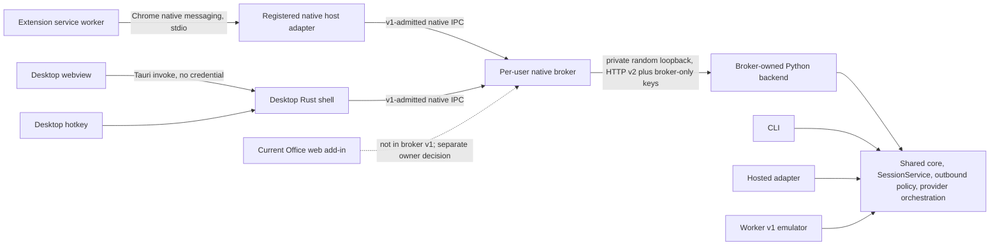

# Phase 8 native broker

- Date: 2026-08-07
- Status: **PROPOSED — owner approved; independent review pending**
- Scope: local installed clients only
- Non-goals: implementation, release, deployment, hosted-service changes, worker
  changes, and product-version changes

The owner approved the four decisions recorded at the end of this document on
2026-08-07. The ADR is not accepted and does not authorize broker production
code until the required independent review passes.

# Context

## Repository facts

The product currently has four execution shapes that must not be conflated.

| Surface | Current execution path and responsibility | Relevance to a broker |
|---|---|---|
| Local HTTP | [`app/server.py`](../../app/server.py) owns strict HTTP-v2 request/response projection, route authentication, `SessionService`, document routes, provider allowlisting, and calls into the shared core. [`launcher.py`](../../launcher.py) and the Desktop shell start it on fixed loopback port 8000. | This is the caller-facing path whose fixed listener does not authenticate the process that owns the port. Its data and control secrets already have separate meanings. |
| Hosted HTTP | [`app/hosted.py`](../../app/hosted.py) narrows the same FastAPI app behind a required deployment API key and provider allowlist. Hosted roundtrip is stateless by default. | The broker must not enter, replace, or weaken this deployment boundary. |
| Local worker | [`app/worker/`](../../app/worker/) implements the separately versioned worker envelope v1, local failure/retry emulation, transport polling, and an idempotency cache. | It is not a production delivery path and is not a broker protocol. |
| CLI | [`ai_guard.py`](../../ai_guard.py) and [`pii_redactor/pipeline.py`](../../pii_redactor/pipeline.py) call the shared core directly and create a per-run in-memory vault. | It does not need a broker and must not be routed through one merely for uniformity. |

The canonical pseudonym-to-original mapping lives in the backend
[`SessionService`](../../pii_redactor/session_service.py). It is memory-only,
has a 1,800-second TTL and a 200-session cap, and currently indexes sessions by
opaque UUID rather than by client principal. Browser, Desktop webview, and
Office JavaScript may retain an opaque `session_id`; they may not receive the
mapping, a provider credential, the local data-plane key, or the control-plane
boot token.

The current control boundary already separates:

- `AIGUARD_TOKEN`, held by the packaged native launcher/shell, from which
  target-bound, short-lived, single-use session-disposal authorization is
  derived by [`app/session_control_auth.py`](../../app/session_control_auth.py);
- `AIGUARD_API_KEY`, the optional HTTP data-plane credential; and
- provider credentials, which are consumed only by configured provider code.

The accepted
[HTTP-v2 decision](2026-08-05-http-contract-v2.md) fixes the health schema to
`control_token_required` and `api_key_required`. Broker attestation or protocol
metadata therefore cannot be added to v2 health. A broker needs an independent
versioned handshake. The accepted
[session-namespaced-token decision](2026-08-06-session-namespaced-token-identity.md)
also does not make a visible token or `session_id` an authentication
credential.

Provider attempts already converge in
[`pii_redactor/ai_client.py`](../../pii_redactor/ai_client.py). The shared
orchestrator performs a fresh outbound-policy scan before every actual attempt,
uses the same immutable masked text, permits no provider fallback, allows at
most three attempts, applies 60 seconds per attempt, and delays retryable
attempts by one then two seconds. A broker must reach that layer through the
existing adapter/core path; it must not add provider calls or retry policy.

The three current Phase 8 source units are already integrated and have separate
acceptance records:

- [explicit-TNER whole-operation failure](../acceptance/2026-08-07-phase-8-tner-fail-closed.md);
- [shared provider orchestration](../acceptance/2026-08-07-phase-8-provider-orchestration.md);
  and
- [authoritative PDF source intervals](../acceptance/2026-08-07-phase-8-pdf-source-intervals.md).

A broker must preserve their exact failure and data-flow boundaries. It does
not strengthen those records into fresh live-provider, packaged, real-host, or
official-platform evidence. The
[F-06 lifecycle record](../acceptance/2026-08-06-f06-session-lifecycle.md)
likewise provides the backend disposal primitive but explicitly leaves
broker-backed client disposal open.

The client paths are different:

- The MV3 [`extension/background.js`](../../extension/background.js) owns all
  backend calls. It selects `localhost:8000` or `127.0.0.1:8000`, retains
  per-tab session references in `chrome.storage.session`, and currently drops
  only its local reference when a tab closes. Content scripts own page
  extraction/writeback; they do not own the backend mapping. The
  [`manifest.json`](../../extension/manifest.json) has loopback host permission
  and no `nativeMessaging` permission.
- Desktop Rust in
  [`desktop/src-tauri/src/lib.rs`](../../desktop/src-tauri/src/lib.rs) spawns
  and stops the Python sidecar, keeps the boot token out of the webview, checks
  a fixed-port owner's image name, and implements the native hotkey/clipboard
  path. The webview in [`desktop/src/api.js`](../../desktop/src/api.js) and the
  Rust hotkey path both call HTTP directly. The image-name check is explicitly
  documented as non-cryptographic.
- The Office task pane is a web add-in. Its
  [`office-addin/src/api.ts`](../../office-addin/src/api.ts) calls `/api`
  through the Vite HTTPS development proxy, while
  [`office-addin/src/controller.ts`](../../office-addin/src/controller.ts)
  keeps only an in-memory session reference. Word, Excel, and PowerPoint
  adapters own host-specific extraction, change detection, and guarded
  writeback. Current composition evidence is a development-proxy preflight,
  not an Office-host or installed-package run. The add-in has no native IPC
  capability or installed native companion.

The Extension and Desktop are therefore direct broker candidates. The current
Office web add-in is not: Microsoft documents Office Add-ins as HTML/JavaScript
running in a
[browser or sandboxed webview](https://learn.microsoft.com/en-us/office/dev/add-ins/concepts/browsers-used-by-office-web-add-ins),
with their pages
[supplied by a web server](https://learn.microsoft.com/en-us/office/dev/add-ins/concepts/requirements-for-running-office-add-ins).
It has no repository-evidenced API for opening a Windows named pipe or
Unix-domain socket. Replacing that boundary with COM/VSTO would also make the
integration Windows-only and would be a product decision, not an implementation
detail.

Chrome does provide a repository-credible native entry point. A registered
[native-messaging host](https://developer.chrome.com/docs/extensions/develop/concepts/native-messaging)
is launched by Chrome, communicates over framed stdin/stdout, and restricts
callers through exact `allowed_origins`. Host registration is installer work
and differs across Windows, macOS, and Linux. Chrome also limits a
native-host-to-extension message to 1 MiB, so this channel is suitable for the
Extension's text operations but must not be assumed to be a general PDF
transport.

## Problem

The local HTTP listener proves neither that a first-party client reached the
backend process spawned from the installed package nor that an arbitrary local
process is authorized to use the data plane. CORS and `TrustedHostMiddleware`
are browser/request-routing defenses, not local process authentication. A
random port alone would reduce collisions but would not establish identity.
Giving the HTTP data or control credential to Extension, webview, or Office
JavaScript would violate the existing trust boundary.

The broker must therefore create a controlled native admission boundary
without:

- moving the canonical mapping out of backend memory;
- forking detection, document, provider, restore, or outbound-policy logic;
- changing HTTP v2, hosted semantics, worker envelope v1, or CLI behavior; or
- claiming that the current Office web add-in has a native identity path that
  the repository does not contain.

# Security properties

Any accepted design must preserve all of these invariants.

1. **Authorized flow only.** Raw source or restored PII may cross only the
   admitted first-party client, broker, and broker-owned backend boundary
   required for the requested operation. It must never cross to another client,
   an unverified listener, logs, errors, or acceptance artifacts.
2. **Mapping confinement.** The pseudonym-to-original mapping remains only in
   the Python backend vault. The broker may retain an in-memory association
   between its opaque session handle and the backend `session_id`; it must
   never receive, persist, reconstruct, or log mapping pairs.
3. **Fail closed.** Unknown peer context, missing or malformed handshake,
   incompatible protocol, backend-listener mismatch, uncertain mutation,
   timeout, broker/backend crash, unsafe response, or failed disposal produces
   no client write and no HTTP fallback.
4. **Client and session isolation.** A session is owned by one admitted native
   connection and one broker-issued scope. A different connection,
   role, tab, window, or hotkey scope cannot restore or dispose it merely by
   presenting its opaque handle.
5. **No provider fallback.** The broker preserves the explicitly selected
   provider and never substitutes another provider, calls a provider directly,
   or repeats a provider-capable operation.
6. **Outbound policy remains authoritative.** Every external-AI call continues
   through the shared protected-provider orchestration and its fresh
   pre-attempt scan. Broker validation is additional containment, not a
   replacement for that boundary.
7. **Credential confinement.** Boot/data-plane keys and provider credentials
   exist only in the trusted native broker/backend process boundary. They are
   not command-line arguments, URLs, JavaScript state, IPC responses, log
   fields, error details, or files created for a request.
8. **Fixed safe errors.** Public broker failures contain only a stable code and
   a bounded retry classification. They contain no request/response values,
   exception text or type, provider body, credential, session handle, process
   path, port, filename, or free-form upstream message.
9. **No accidental or cross-user local exposure.** A same-machine process does
   not gain data access merely by discovering an endpoint. OS endpoint access
   control and peer context, platform-origin/command authorization, package
   consistency checks, and protocol role authorization must all succeed before
   payload parsing. Package consistency is not publisher or application
   authentication.
10. **Lifecycle disposal.** Closing a client scope or admitted connection
    disposes its backend sessions. If disposal cannot be confirmed, the broker
    invalidates every affected handle and terminates the backend rather than
    retaining an uncertain mapping.
11. **No persistence on recovery or upgrade.** Broker/backend restart and
    upgrade discard sessions and mappings. Old masked text is never restored
    through a newly created session.
12. **Bounded work.** Frames, connections, in-flight operations, per-principal
    sessions, and queues are bounded. Limit failures are fixed and value-free.

Within its approved v1 boundary, the design protects against unauthorized
remote/web origins, other OS users, cross-client or cross-session confusion,
accidental local exposure, protocol misuse, and unsafe fallback.

The following limitations are explicit:

- OS peer credentials establish OS-user and process context; they are not
  cryptographic publisher attestation.
- Installed path, build identifier, and digest checks provide package
  consistency only. They are not strong application authentication.
- The design does not claim protection against arbitrary malicious code already
  executing as the same OS user.
- The design does not claim protection against compromise of the user's OS
  account.
- The design does not claim protection against replacement or tampering of
  unsigned installed binaries.

The accepted unsigned-distribution decision therefore remains unchanged.
Expanding this threat model requires a separate owner decision.

# Options considered

The assessments below separate repository facts from recommendations. “Native
IPC” means a Windows named pipe or a filesystem Unix-domain stream socket on
macOS/Linux. “Per-client process” means a private inherited stdio/handle
channel. “Hybrid” combines a shared native broker, a Chrome stdio adapter, and
the existing Python HTTP adapter on a private authenticated loopback listener.

| Dimension | 1. Localhost HTTP broker | 2. Shared native IPC broker | 3. Per-client spawned broker | 4. Hybrid native broker |
|---|---|---|---|---|
| Security boundary | Still exposes a discoverable TCP listener. TLS, CORS, random port, or loopback binding alone does not prove process identity. | Kernel endpoint ACL plus peer credentials creates a materially stronger local boundary without a port. | Strongest default channel: parent and child inherit private handles and no unrelated process can connect. | Native clients get option 2's boundary; Chrome gets option 3's channel; the existing Python listener is private, randomly bound, and requires broker-only credentials. |
| Admission and authorization | Requires a credential, mTLS, or process-to-TCP attribution. JavaScript cannot safely hold the existing credentials. | OS ACLs and peer credentials establish user/process context; platform authorization and role checks gate operations; path/build/digest checks detect package mismatch but do not authenticate a publisher or defeat same-user malware. | Parent/child relationship and inherited handles establish a private channel; platform caller authorization is still required. | Same as native IPC, with exact Chrome `allowed_origins`, allowlisted Tauri commands, and strict broker-to-backend key checks. |
| Process ownership | Could be a service, Desktop child, or independent daemon; the repository has selected none. | One on-demand per-user broker owns one backend child. | Chrome/Desktop each owns a separate broker/backend process. | One on-demand per-user broker owns the backend; Desktop or the registered Chrome host may start the single instance. |
| Portability | HTTP libraries are universal. Local TLS and secure credential delivery are not operationally free. | Named-pipe and UDS implementations are platform-specific but standard. | Stdio is portable; parent/lifecycle behavior and packaging still differ. | Common protocol and policy with thin Windows/macOS/Linux endpoint adapters and one Chrome stdio adapter. |
| Lifecycle | Easy health probing, but stale listeners and port ownership remain concerns. | Broker explicitly owns endpoint, child, client connections, sessions, and shutdown. | Lifecycle follows each client channel, which simplifies cleanup but makes MV3 or UI disconnects destroy all state. | Shared broker provides one backend lifecycle while connection-bound scopes preserve deterministic disposal. |
| Crash recovery | Clients can reconnect, but cannot know whether an in-flight mutation completed without added semantics. | Disconnect invalidates handles; backend restart clears all mappings. No mutation is replayed. | A client restart creates a fresh empty vault and cannot restore prior text. | Same fail-closed model as native IPC; a later new request may start a fresh child, but the failed request is never replayed. |
| Concurrency | FastAPI already handles concurrent callers, but HTTP alone does not establish ownership. | A bounded broker executor can serialize mutations per session and allow bounded work across principals. | Natural process isolation, at the cost of duplicate backends and provider/model resources. | Shared bounded execution plus explicit principal/scope/session ownership; backend locking remains authoritative. |
| Session isolation | Must add an admitted and authorized principal above the global `SessionService`; possession of a raw UUID is otherwise sufficient. | Broker-issued handles map to backend IDs and are checked against connection and scope before every use. | Separate processes isolate clients by construction; tab/window isolation still needs scopes. | Same as shared native IPC; the canonical mapping never leaves `SessionService`. |
| Deployment and packaging | Lowest code change, but requires secure local certificate/key provisioning and still leaves browser-facing HTTP. | Adds a native executable, OS endpoint code, installer lifecycle, and component manifests. | Adds a native host/backend per storefront and duplicates packaging/startup. | Adds one broker plus a small Chrome adapter and changes the existing Desktop installer to register/package them. |
| Extension/Desktop/Office | All can issue HTTP, but Extension/Office/webview cannot safely hold the credential that would make it secure. | Desktop works directly; Extension needs native messaging; current Office cannot connect. | Desktop and Extension fit; current Office cannot spawn or attach. | Desktop and Extension fit their platform-native paths. Office remains explicitly blocked pending a separate native-companion decision. |
| Testing | Simple functional tests; difficult negative proof for local process identity and certificate deployment. | Needs OS ACL, peer identity, framing, race, crash, isolation, and packaging tests on three OSes. | Needs lifecycle/resource tests for every client process and MV3 disconnect behavior. | Highest integration matrix, but boundaries can be tested independently and the existing HTTP/core contract remains reusable. |
| Migration impact | Smallest client diff but leaves the core trust gap or pushes credentials into clients. | Large client/packaging cutover and no Office path. | Large duplicated runtime cutover with user-visible session loss on client suspension. | Largest planned packaging change, but it preserves one core, gives Extension/Desktop a credible identity path, and isolates the unsolved Office decision. |

## Option 1: localhost HTTP broker

This could retain every existing client call and add a random port, local TLS,
and a bearer key. It is attractive for portability and Office compatibility.
It is not acceptable as the primary trust boundary because the first-party
JavaScript clients cannot own that bearer key. An endpoint that grants a cookie
or key to any process that can load a localhost page remains anonymous local
access. TCP-to-process attribution would also be new platform-specific security
code while retaining the listener that the broker is meant to remove.

## Option 2: shared named-pipe/UDS broker

This gives the Desktop a direct native path, permits kernel access control, and
lets the broker bind session ownership to a peer connection. Windows named
pipes support
[explicit DACLs](https://learn.microsoft.com/en-us/windows/win32/ipc/named-pipe-security-and-access-rights)
and client PID/token inspection. Linux UDS supports filesystem permissions and
[`SO_PEERCRED`](https://man7.org/linux/man-pages/man7/unix.7.html); macOS needs
its corresponding peer-credential/audit-token implementation. It is not by
itself compatible with Chrome Extension JavaScript or the Office webview.

## Option 3: per-client spawned or stdio/native-messaging process

This is the natural Chrome design and a strong Desktop design because the
channel is private and the platform owns process startup. Making it the entire
architecture would run separate Python cores and vaults for Desktop, every
Chrome native port, and any future native client. It would duplicate memory and
provider resources, make state depend on MV3 connection lifetime, complicate
upgrades, and still not give the Office web add-in a native launch API.

## Option 4: hybrid native broker

This uses native IPC as the installed client boundary, a small stdio adapter
only where Chrome requires it, and an authenticated private loopback connection
from the broker to the existing Python HTTP-v2 adapter. It preserves the shared
core and allows migration in independently testable slices. Its cost is a new
native TCB, three OS endpoint implementations, installer registration, and an
explicitly deferred Office integration.

# Recommended decision

**Owner-approved decision, pending independent review:** choose option 4, with
Office excluded from broker protocol v1 until a separate ADR approves a
concrete native Office integration.

## Client scope

Broker protocol v1 serves two installed client principals:

- `desktop`, represented only by the Tauri/Rust process admitted under the v1
  boundary; and
- `extension`, represented only by the registered Chrome native-messaging
  adapter after Chrome and the adapter validate the exact allowed extension
  origin.

The Desktop process creates separate UI and hotkey scopes internally. The
Extension adapter creates separate tab and side-panel scopes. CLI, hosted,
worker, demo/development HTTP, and current Office JavaScript are not broker
principals.

## IPC and process ownership

1. Install one native broker executable per product installation. Run at most
   one instance per OS user/logon session, on demand; do not install a privileged
   system service.
2. The first v1-admitted Desktop launcher or registered Chrome native host
   starts the broker from the expected installed path. Single-instance creation
   and endpoint publication must be atomic. A stale endpoint or unexpected
   owner fails closed.
3. Expose a Windows named pipe with an explicit current-logon-user DACL. Expose
   a filesystem Unix-domain stream socket in a user-private runtime directory
   on macOS/Linux with directory mode `0700` and socket mode `0600`. Do not use
   a Linux abstract socket because it has no filesystem permission boundary.
4. The broker owns one Python backend child. It starts the child on a
   broker-selected random `127.0.0.1` port with both data-plane and control-plane
   protection required. No installed client receives that port or either key.
5. Bootstrap secrets pass through an inherited anonymous pipe/handle, not
   command-line arguments, a request URL, stdout, or a request-scoped file.
   The broker verifies that the bound listener belongs to its live child before
   sending any secret-bearing request. Backend access logs are disabled.
6. On Windows, a Job Object ties the child to the broker. On macOS/Linux, the
   equivalent process-group/parent-death supervision is required. If the broker
   exits, the backend must not remain listening.

The private loopback child transport is a migration seam, not the client trust
boundary. A later inherited-handle backend transport may replace it without
changing the broker protocol.

The loopback address, port, and backend credentials are never returned to a
storefront. Production Extension and Desktop code contains no backend URL,
probing path, or direct HTTP client. Failure to establish native IPC produces a
fixed unavailable result; it never falls back to localhost HTTP. Source
development may retain an explicitly started HTTP path, but that path is not
reachable through, or selected by, an installed storefront.

## Secret and sensitive-state ownership

| State | Owner and lifetime |
|---|---|
| Backend control token and data-plane key | Generated by the broker per backend boot, delivered through the inherited bootstrap channel, held only by broker/backend native memory, and discarded on child shutdown. |
| Provider credentials/configuration | Read only from the existing approved local configuration source by the trusted broker/backend boundary and delivered to the child without exposing it to a client. Provider code remains the only consumer; the broker does not log, return, or persist it. This ADR does not select a new credential store. |
| Canonical mapping and vault salt/state | Python `SessionService` only, for the existing session lifetime. It never enters broker state or IPC. |
| Broker session ownership | In-memory broker handle to backend `session_id`, admitted connection, broker-issued scope, mode, and lifecycle metadata. It is never persisted or logged. |
| Raw, masked, or restored content | Transient request/response buffers in the admitted client, broker, and backend only. No request cache, crash dump artifact, queue, or diagnostic copy is introduced. |
| Package consistency metadata | Non-secret installed paths, product/build identifiers, and expected component digests in the packaged component manifest. These detect a mismatched component only; they are not publisher or application authentication. Observed values are not logged on mismatch. |

## Client authentication and authorization

Admission and authorization have four mandatory checks. They deliberately do
not conflate OS context or package consistency with publisher-backed
application authentication:

1. **Endpoint and OS context:** the client checks that the endpoint belongs to
   the broker instance it started or expected. The broker obtains the peer's
   logon SID/token and PID on Windows, or UID/GID and peer process credentials
   on macOS/Linux, and holds a stable process reference while inspecting it.
   Client-supplied PID or role values are never evidence. These checks establish
   OS-user/process context only.
2. **Package consistency:** the peer executable's canonical installed path,
   build identifier, and digest must match the packaged component manifest.
   Mismatch, inability to inspect, or PID reuse fails closed. A match does not
   authenticate a publisher, prove an untampered unsigned installation, or
   protect against malicious code already running as the same user.
3. **Platform caller authorization:** Chrome enforces exact native-host
   `allowed_origins`, and the adapter rechecks the origin and expected browser
   process context. Desktop exposes only allowlisted Tauri commands to allowed
   windows; webview JavaScript never opens native IPC itself.
4. **Role handshake:** after those admission checks, a strict hello selects one
   common broker protocol and maps the connection to an allowlisted role. A
   role claim inconsistent with the admitted platform channel is rejected.

The initial roles are:

- `desktop`: the complete installed Desktop operation set plus broker lifecycle
  control; and
- `extension`: only the operations implemented by the Extension, with no
  shutdown or policy-expansion authority.

Chrome provides an additional boundary. Its native-host manifest contains one
or more exact, stable extension origins and no wildcard. The adapter checks the
origin argument, expected browser process context, broker protocol, and package
consistency before forwarding. It accepts no standalone command-line or
interactive mode.

The Desktop webview never opens the pipe and never receives a native credential.
It calls allowlisted Tauri commands; Rust validates the command payload and
projects the fixed broker result. Tauri capability/window labels remain an
authorization layer inside the Desktop client.

The Desktop companion/package installs and updates the broker, Chrome adapter,
and native-host registration. That distribution ownership does not make the
Extension depend on the Desktop GUI lifecycle: the registered native host can
start or connect to the shared broker while the Desktop GUI process is closed.

## Session ownership

The broker returns an opaque broker session handle in the broker contract's
`session_id` field. It is not the backend UUID. The broker stores only:

- broker handle to backend `session_id`;
- admitted connection and broker-issued scope ownership;
- mode and lifecycle metadata needed to validate use; and
- no source, restored text, entity value, replacement, mapping, or credential.

Desktop UI, Desktop hotkey, and each Extension tab/panel use separate
broker-issued scopes. A session handle is accepted only when the admitted
connection and scope both own it. The backend's existing TTL and global cap
remain authoritative and are not extended by broker activity. The broker adds
bounded per-principal accounting to prevent one client from consuming the
whole global cap; exact limits must be measured and fixed in the protocol
implementation, not invented in this ADR.

Normal scope/connection close invokes the existing authenticated disposal path.
The broker creates the short-lived target-bound authorization internally; the
boot token never crosses to a client. If disposal is rejected, times out, or
has an uncertain result, the broker tears down the child backend and invalidates
all handles rather than claiming eager deletion. That availability loss is the
fail-closed consequence of an uncertain mapping lifecycle.

A broker or backend restart invalidates every session handle. Clients may start
a new sanitize operation, but they must not automatically create a replacement
session to restore text produced by the lost session.

## Request and response contract

Broker protocol versioning is independent of product `VERSION`, HTTP contract
2, and worker envelope 1.

- The first framed message is a strict `hello` containing a finite list of
  supported broker protocol integers, client product version, and claimed role.
  Role binding comes from the admitted platform channel; claimed fields are not
  identity evidence. The broker selects the highest common protocol or returns
  fixed `broker_incompatible`.
- Protocol v1 uses length-prefixed UTF-8 JSON objects. All schemas reject
  unknown fields, invalid Unicode, duplicate semantic fields, oversized frames,
  and operations outside the authorized role.
- A request contains exactly `broker_protocol_version`, an opaque
  `request_id`, `operation`, a broker-issued `scope_id` when required, and a
  strict operation payload. The broker—not the client—selects the operation
  deadline.
- A success contains the same protocol and request ID plus one strict result.
  Result shapes reuse the semantics and privacy minimization of HTTP v2, but
  the broker validates the child response header and exact projection before
  wrapping it.
- A failure contains the same protocol and request ID plus only a fixed error
  code and retry classification. It never carries the underlying HTTP status
  body or exception.
- Each operation has an explicit maximum derived from the existing adapter/core
  limit before that operation is enabled. There is no universal worker-style
  1 MiB assumption. The Extension subset must additionally fit Chrome's 1 MiB
  native-host response ceiling. PDF bytes are not enabled over Chrome native
  messaging.

There is no broker-to-HTTP downgrade or direct-client HTTP fallback. A client
that cannot complete hello remains unavailable.

## Provider access, retries, and timeouts

The broker forwards the explicit provider selection to the local adapter. The
adapter reaches the shared provider registry and protected-provider
orchestration. The broker neither reads a provider response body on failure nor
changes provider selection.

Provider-capable operations get a broker deadline that cannot expire before the
existing worst-case orchestration budget of three 60-second attempts plus the
one- and two-second delays and bounded adapter overhead. Non-provider and
document deadlines are enabled only after the corresponding current path is
measured; a timeout table becomes part of protocol conformance tests.

The broker never retries a data operation. In particular, it does not replay a
sanitize, restore, PDF, or provider-capable request after disconnect, timeout,
or an unknown child result. Only a later, new request may start a fresh backend
after a crash. If an in-flight stateful result is uncertain, its whole session
scope is invalidated.

## Lifecycle and concurrency

- One bounded broker executor serves admitted connections. There is no
  unbounded task or message queue.
- Mutating operations for one session scope are serialized. Independent
  principals/scopes may run concurrently within global and per-principal
  bounds. The existing backend lock and transactional semantics remain
  authoritative.
- When the last admitted connection closes, all its scopes are disposed. When
  no admitted connections, live handles, or in-flight operations
  remain, the on-demand broker stops its backend and exits; no always-on service
  is required.
- A client disconnect, broker crash, backend crash, or OS shutdown projects a
  fixed unavailable error and causes no DOM, clipboard, file, or Office write.
- A later start creates a new broker instance, new boot/data keys, a new child,
  and empty session state.

## Upgrade and compatibility

The Desktop installer updates the Desktop shell, broker, Chrome adapter,
component manifest, and Python sidecar as one component set. The broker refuses
to start a sidecar whose build identifier/digest does not match that set.
The native host launches/connects to the shared broker directly; the Desktop
GUI process is not a runtime dependency.

Every client advertises an explicit finite set of supported broker protocols.
There is no implicit “close enough” product-version rule and no silent
downgrade. An independently updated Extension may support more than one
explicit protocol, but compatibility exists only when tested and listed. With
no intersection, the client shows a fixed upgrade-required state and sends no
PII.

An installer upgrade drains/stops the broker. It does not migrate or serialize
sessions. Any old masked text must be sanitized again from its original source;
it is not restored through a new vault. Product version remains `2.5.0` during
development. Version bump, tag, and release remain separate release work.

## Error projection and observability

The broker and native adapters use a closed error vocabulary such as
`broker_unavailable`, `broker_unauthorized`, `broker_incompatible`,
`request_invalid`, `operation_timeout`, `operation_failed`,
`session_unavailable`, and the already stable safe core/provider policy codes.
Clients branch only on documented codes and never on free-form text.

Production logs may contain only a stable event code, authorized role,
operation name, protocol/build version, fixed outcome, bounded count, and
coarse duration. They must not contain:

- raw, masked, or restored request/response text;
- entity values, replacements, mapping material, or document bytes;
- request, session, scope, nonce, audit, or operation identifiers;
- credentials, authorization headers, environment values, ports, URLs, query
  strings, process paths, usernames, filenames, clipboard values, or provider
  bodies; or
- exception messages, debug representations, or payload-derived metrics.

Authentication diagnostics use fixed reasons such as
`peer_component_mismatch`, never the observed path or digest. Acceptance uses
synthetic PII and scans captured stdout/stderr and projected errors for the
sentinels.

## Platform and client implications

### Windows

- Implement the named pipe with an explicit current-logon SID DACL; do not
  accept the permissive default descriptor, and reject remote pipe clients.
- Inspect the client token and PID from the pipe, hold the process handle during
  admission checks, and verify package consistency against the installed
  component manifest.
- Use a Job Object for broker/backend teardown.
- The per-user installer must register the Chrome native-host manifest under
  the correct HKCU registry view and remove/update it safely.
- The existing unsigned-install decision remains. Runtime digest checks do not
  become application authentication or a code-signing claim.

### macOS

- Use a filesystem UDS in a private per-user runtime directory and the
  platform's peer-credential/audit-token facilities.
- Package broker, adapter, component manifest, and sidecar in the app bundle
  with stable absolute native-host registration.
- Test app-bundle relocation, upgrade, browser host discovery, and child
  teardown. Existing signing/notarization status is not changed by this ADR.

### Linux

- Prefer `$XDG_RUNTIME_DIR` only after validating that it is owned by the user
  and private; otherwise create a verified private runtime directory. Use
  filesystem permissions plus `SO_PEERCRED`.
- Package/register native-host manifests for the supported Chrome/Chromium
  paths without assuming an AppImage and a Debian package share installation
  behavior.
- Do not require systemd or a system-wide daemon; start on demand.

### Extension

Eventually add `nativeMessaging`, remove loopback host permissions from the
production manifest, replace fetch/backend discovery with one long-lived
native port, validate the broker hello/result contract, and dispose tab/panel
scopes on closure. A native-port disconnect invalidates its sessions and blocks
restore/write until a new sanitize starts. The installer must establish a
stable extension ID/origin and native-host registration before packaged
acceptance.

### Desktop

Eventually move every webview operation behind allowlisted Tauri commands and
move the Rust hotkey path to the same broker client. Remove direct loopback
fetch and the HTTP CSP allowance from production. Rust becomes the sole native
client, while the broker—not the Tauri window—owns backend identity, secrets,
session disposal, and child lifecycle.

### Office

Do not route current Office JavaScript to the native pipe, give it a broker
credential, or label the Vite development proxy a production identity
boundary. Broker v1 leaves Office unchanged and unaccepted.

A follow-on owner decision must choose one of:

- replace/supplement the current web add-in with a Windows-native Office
  companion that can establish native process identity; or
- design and prove a broker-owned HTTPS bridge whose caller authentication
  never exposes a credential to JavaScript and rejects arbitrary local
  processes; or
- keep Office as a separately started development/enterprise path and defer
  broker-backed Office disposal.

That choice changes product/platform scope and is intentionally not invented
here.

# Rejected alternatives

- **Fixed or random localhost HTTP as the client boundary:** rejected because
  the current JavaScript clients cannot safely own the credential needed to
  turn a discoverable listener into authenticated process access.
- **CORS, `Origin`, `Host`, or process image name as authentication:** rejected
  because local non-browser callers can forge request headers, and an image
  name is not publisher or application authentication.
- **Expose the boot token or derived disposal authorization to clients:**
  rejected by the accepted control/data-plane separation and because it would
  authorize more than an opaque session handle.
- **Use the worker envelope or worker retry loop:** rejected because worker v1
  is a local emulator with different transport/idempotency semantics and is
  explicitly not the delivery path.
- **Make every client own a complete broker/backend process:** rejected as the
  universal design because it duplicates resources and makes Extension session
  lifetime depend on MV3 native-port lifetime. Stdio remains selected only for
  Chrome's required adapter.
- **Put mappings in Rust to avoid the Python child:** rejected because it forks
  the core trust boundary and duplicates vault/restore logic.
- **Automatic HTTP fallback or request replay:** rejected because either can
  send PII to an unverified process or repeat an operation whose completion is
  unknown.
- **Claim Office support through the current HTTPS dev proxy:** rejected because
  HTTPS protects transport but does not authenticate the local calling process,
  and the current evidence never ran inside an Office host.
- **Install a privileged OS service:** rejected because repository evidence
  does not require cross-user service, machine-wide state, or elevated
  lifecycle, and it would enlarge the trust and packaging surface.

# Consequences

## Implementation work

- Add a native broker protocol, platform IPC adapters, OS peer/process context,
  bounded concurrency, session ownership, lifecycle supervision, and fixed
  error/log projection.
- Add a private authenticated sidecar mode without changing the public HTTP-v2
  contract.
- Move Desktop and Extension calls to their native bridges and add eager scope
  disposal.
- Keep CLI, hosted, worker v1, and the shared core paths structurally separate.

## Security implications

- Unauthorized remote/web origins, other OS users, accidental local callers,
  and cross-client/session use lose direct access to the installed data plane
  within the stated v1 threat boundary. Same-user malicious code remains
  explicitly out of scope.
- The broker and its native adapters join the trusted computing base and see
  request/response data transiently. Their parsing, logging, crash, and memory
  behavior require the same privacy review as the Python boundary.
- An uncertain disposal can invalidate unrelated clients because killing the
  one shared backend is safer than retaining an uncertain mapping.
- The design does not strengthen the accepted unsigned-distribution threat
  model into protection from same-user arbitrary code execution.

## Operational implications

- Installed local operation gains a broker/child startup phase and fixed
  compatibility failures.
- Restart or upgrade deliberately loses all sessions.
- Support diagnostics become more structural and less verbose; raw traces are
  forbidden even in debug/acceptance output.
- The fixed port can remain for explicit source development and isolated
  adapter tests, but it is not a production-client fallback.

## Client changes

- Desktop Rust becomes the only Desktop network/native client; webview JS no
  longer fetches loopback.
- Extension background uses a registered native port and production manifest
  no longer needs loopback hosts.
- Office remains open and cannot be counted as broker-backed acceptance.

## Packaging changes

- The Desktop companion installer must carry the broker, Chrome adapter,
  component manifest, Python sidecar, and platform registration/unregistration.
- Windows, macOS, and Linux package layouts and browser registration differ and
  each need installed-artifact evidence.
- Extension usability becomes dependent on installation of the native
  companion unless a separately approved distribution path is added.

## Testing requirements

- Protocol schema, framing, size, malformed/unknown-field, fuzz, and
  compatibility tests.
- Other-user, wrong-peer, wrong-path, wrong-digest, stale endpoint, PID reuse,
  permissive ACL/mode, and direct-private-port rejection tests.
- Concurrent cross-principal/tab/window/hotkey session isolation, expiry,
  eviction, disconnect, disposal, failed-disposal backend teardown, and
  restart/upgrade invalidation tests.
- No-fallback/no-replay call-count tests and shared outbound scan/provider retry
  tests.
- Sentinel-based stdout/stderr/error/privacy tests using synthetic PII.
- Windows named-pipe, macOS UDS, Linux UDS, Chrome native-host, installed
  Desktop, and eventually separately approved Office real-host acceptance.
- Affected Python, JS, Rust, Office, version, packaging, and performance gates
  from the repository check matrix.

## Platform-specific work

Windows needs named-pipe ACL/token/PID checks, Job Object supervision, and HKCU
Chrome registration. macOS needs UDS peer context, app-bundle/native-host
layout, and lifecycle acceptance. Linux needs verified runtime-directory
handling, `SO_PEERCRED`, AppImage/deb-specific registration, and teardown
acceptance. None can be certified by a single-OS mock.

# Implementation slices

Every slice is a separate short-lived branch after owner approval. A slice does
not enable a production client until its negative security tests pass.

## Slice 1 — protocol and conformance fixtures

- **Scope:** Define broker hello, framing, strict request/response schemas,
  fixed errors, role/operation matrix, size/deadline table, and synthetic
  conformance vectors. No listener or client cutover.
- **Dependencies:** Approved ADR and confirmed operation inventory.
- **Acceptance criteria:** Unknown fields/versions/roles/operations and
  malformed/oversized frames fail with exact value-free errors; HTTP v2,
  worker v1, and `VERSION` are unchanged.
- **Likely components:** new `native-broker/` contract module or equivalent,
  shared synthetic fixtures under `tests/`, architecture/code-map updates only
  where the new code actually lands.
- **Tests:** Rust/Python cross-language vectors, Unicode boundaries, partial
  frames, duplicate request IDs, extension 1 MiB response boundary, log
  sentinel scan.
- **Rollback conditions:** schema requires a mapping/credential in a client,
  overloads HTTP v2 or worker v1, permits unknown fields, or lacks a fixed
  failure for incompatibility.

## Slice 2 — admitted broker bootstrap and health only

- **Scope:** Build the on-demand single-instance broker, Windows pipe and
  macOS/Linux UDS adapters, OS peer-context and package-consistency admission,
  private random-port backend startup, inherited secret bootstrap, child
  supervision, and broker hello/health. Enable no PII operation.
- **Dependencies:** Slice 1; platform APIs available on all three CI/release
  targets.
- **Acceptance criteria:** only allowlisted installed native fixtures complete
  hello; arbitrary/other-user/wrong-build peers and direct private-port calls
  cannot reach data routes; broker death terminates the child; no secret or
  endpoint value appears in output.
- **Likely components:** new native broker crate, `launcher.py`,
  `app/server.py` private-mode startup, Desktop build/sidecar staging scripts,
  CI placeholders and platform tests.
- **Tests:** ACL/mode assertions, peer PID/UID race cases, stale endpoint,
  port-owner substitution, child mismatch/crash, secret-channel closure,
  cross-platform build/smoke, captured-log sentinel scan.
- **Rollback conditions:** any anonymous data access, permissive endpoint,
  unverified child, orphan listener, secret-bearing argv/file/log, or
  cross-platform build failure.

## Slice 3 — broker data plane, session ownership, and disposal

- **Scope:** Proxy the strict local operation set to HTTP v2, validate exact
  child responses, add broker handles/scopes, serialize session mutations,
  preserve provider orchestration, and implement confirmed disposal or backend
  teardown. No storefront cutover.
- **Dependencies:** Slice 2 and existing F-06 disposal plus provider
  orchestration.
- **Acceptance criteria:** cross-principal/scope handles never restore; mapping
  remains backend-only; every external attempt still passes the shared outbound
  check; broker call counts show no provider fallback or data replay; uncertain
  disposal clears the child and all handles.
- **Likely components:** broker routing/session modules, `app/server.py`,
  `app/session_control_auth.py` test vectors, strict adapter tests, no worker or
  hosted behavior change.
- **Tests:** concurrent session isolation, expiry/eviction, replay, disconnect,
  child/broker crash, timeout after unknown completion, provider retry matrix,
  unsafe response, PDF/document size/deadline tests, privacy scan.
- **Rollback conditions:** raw backend IDs cross to clients, mapping reaches
  broker/client, a handle is usable outside its owner, disposal is unconfirmed
  without teardown, or any broker retry/fallback bypasses shared policy.

## Slice 4 — Desktop migration

- **Scope:** Route every Desktop webview and hotkey operation through Rust/Tauri
  to the broker, transfer sidecar lifecycle to the broker, add UI/hotkey scope
  disposal, and remove production direct-loopback access.
- **Dependencies:** Slice 3 supports the complete Desktop operation inventory.
- **Acceptance criteria:** no webview fetch/credential/loopback CSP, no Rust
  direct HTTP client, exact broker/result validation before clipboard/file/UI
  write, session separation across UI and hotkey, clean shutdown disposal, and
  installed Windows plus cross-platform package smoke.
- **Likely components:** `desktop/src-tauri/src/lib.rs`,
  `desktop/src/api.js`, Tauri capabilities/config/Cargo files, Desktop tests,
  staging and release workflows.
- **Tests:** Tauri command authorization, malformed broker response, hotkey/UI
  isolation, broker offline/crash/upgrade, clipboard negative controls,
  packaged installed-artifact tests on each built OS.
- **Rollback conditions:** any direct HTTP fallback, credential in webview,
  unsafe write after broker uncertainty, regression beyond the performance
  budget without owner explanation, or incomplete package teardown.

## Slice 5 — Chrome Extension native-messaging migration

- **Scope:** Add the registered stdio adapter and exact extension origin,
  replace background fetch with one native port, add tab/panel scopes and
  disposal, remove production loopback host permissions, and package
  registration/unregistration.
- **Dependencies:** Slice 3; stable extension identity and companion-install
  distribution approved by the owner.
- **Acceptance criteria:** unregistered/wrong-origin callers are rejected;
  content scripts never receive native credentials or backend IDs; disconnect
  blocks restore/write; tab/panel close disposes only its scope; no loopback
  fallback; real Chrome and installed-companion acceptance pass.
- **Likely components:** `extension/manifest.json`,
  `extension/background.js`, extension tests, native-host adapter/manifest,
  Desktop installer and platform registration scripts.
- **Tests:** wrong origin/parent, MV3 suspend/reconnect, partial/oversized native
  frames, simultaneous tabs, closed-shadow restore, backend/broker crash,
  install/update/uninstall registration on Windows/macOS/Linux.
- **Rollback conditions:** wildcard origin, manually invokable privileged host,
  session crossing tabs, host-to-extension response over Chrome's limit,
  credential/PII in logs, or retained host permissions/direct HTTP.

## Slice 6 — cross-platform package and upgrade recertification

- **Scope:** Exercise the exact broker-enabled artifact set on
  Windows/macOS/Linux, mixed component/protocol versions, upgrade drain, browser
  registration, and cleanup. This is acceptance and packaging hardening, not a
  feature expansion.
- **Dependencies:** Desktop and Extension slices; exact candidate artifacts.
- **Acceptance criteria:** all three installed artifact sets start only matched
  components, incompatible clients fail closed, upgrade leaves no listener or
  mapping, uninstall removes registration, and every affected CI/release gate
  is green.
- **Likely components:** CI/release workflows, package metadata, acceptance
  scripts/records, current-state docs.
- **Tests:** exact installed binaries, component digest mismatch, upgrade with
  live scopes, uninstall, crash recovery, private-port denial, structural log
  capture, official Chrome and Desktop paths.
- **Rollback conditions:** a platform needs a weaker auth boundary, upgrade
  retains/restores a mapping, any job is red, or evidence comes only from mocks
  when the gate is installed/official-platform.

## Slice 7 — Office architecture, only after a second owner decision

- **Scope:** Write and approve a separate ADR selecting a Windows-native
  companion, a proven authenticated HTTPS bridge, or continued deferral. Do not
  implement Office broker calls before that decision.
- **Dependencies:** Broker boundary evidence from earlier slices and a concrete
  Office host/distribution target.
- **Acceptance criteria:** the selected design authenticates the Office caller
  without a JavaScript credential, rejects arbitrary local processes, preserves
  document/writeback guards, and defines packaging across every claimed Office
  platform.
- **Likely components:** the follow-on ADR; eventually `office-addin/` plus a
  new native companion/bridge if approved.
- **Tests:** real Word/Excel/PowerPoint host tests, wrong local process,
  credential absence, session disposal, malformed/unsafe write blocking,
  installed unified-package activation.
- **Rollback conditions:** authentication depends only on Origin/CORS, a secret
  reaches JavaScript, the design silently becomes Windows-only without owner
  approval, or development-proxy evidence is presented as Office-host
  acceptance.

# Owner decisions

Recorded 2026-08-07:

1. **Approved — hybrid native broker.** Use a shared per-user broker, Windows
   named pipe, macOS/Linux filesystem UDS, Chrome Native Messaging adapter,
   allowlisted Tauri command bridge, and broker-private authenticated loopback
   to the existing Python HTTP-v2 backend. The private backend binds only to
   loopback, uses broker-generated authentication material, exposes no
   credential or endpoint to storefronts, and is never a storefront fallback.
2. **Approved with explicit threat-boundary limitation — unsigned
   distribution.** OS peer credentials establish OS-user/process context only.
   Path/build/digest checks establish package consistency only. Broker v1 makes
   no publisher-attestation, same-user-malware, compromised-account, or
   unsigned-binary-tamper-resistance claim. It still protects, within that
   boundary, against unauthorized remote/web origins, other OS users,
   cross-client/session confusion, accidental local exposure, protocol misuse,
   and unsafe fallback.
3. **Approved for v1 — Desktop companion owns Extension native-host
   distribution.** The companion package installs and updates the broker,
   Chrome adapter, and native-host registration. Runtime remains Extension →
   Chrome native host → shared broker and does not require the Desktop GUI
   process to be open. Compatibility is explicit through broker protocol
   negotiation.
4. **Approved — Office remains outside broker protocol v1.** The existing
   Office web-add-in architecture remains unchanged. Any future native Office
   integration requires a separate ADR with a concrete supported host/bridge
   architecture and its own security, packaging, and acceptance criteria.

These owner decisions remove the product-direction block. ADR acceptance and
integration still require the independent review and green repository gates.
